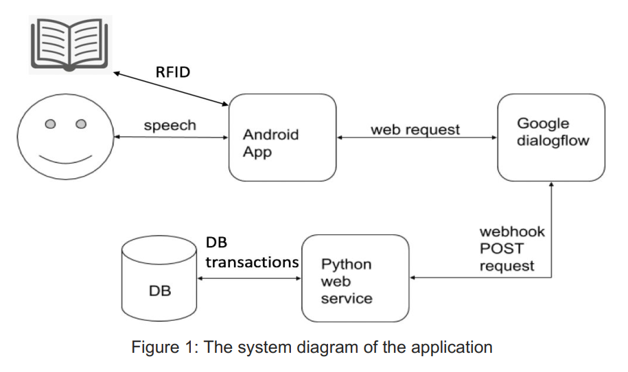
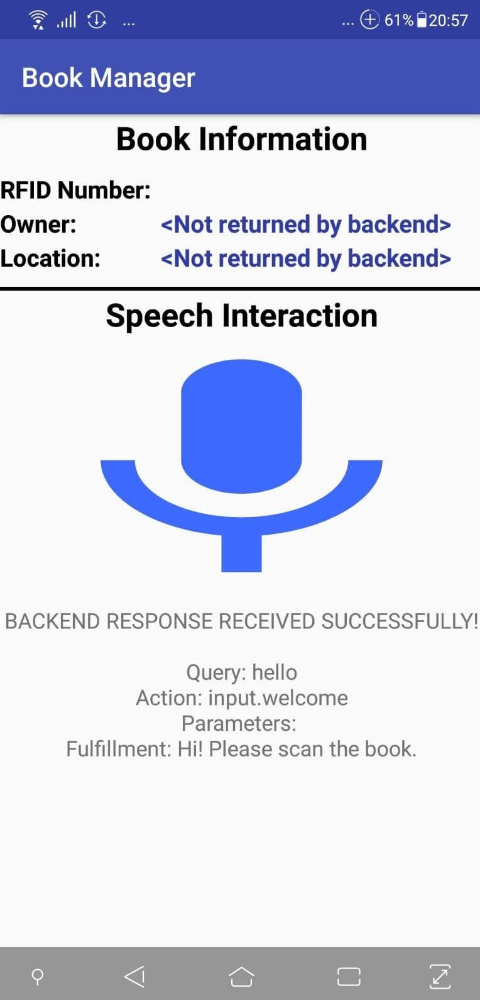

# Book Manager App

We built a full scale prototype system that registers RFID tagged books at KTH library using speech (voice commands). The purpose of this project is to apply and evaluate speech technology in the construction of a dialog system with real world application. This project is the part of the course DD2112, Speech Technology.

**Team Members**: Chalumuri, Vivek (vivekc@kth.se) | Chun Hung Lin (chlin3@kth.se) | Tan, Run Yan (rytan@kth.se)

### System Design

### App

  

